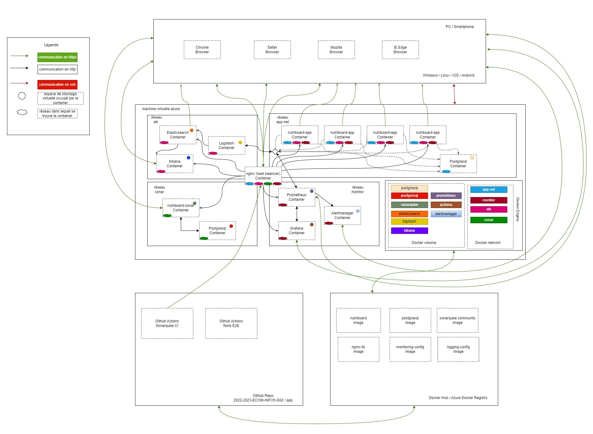
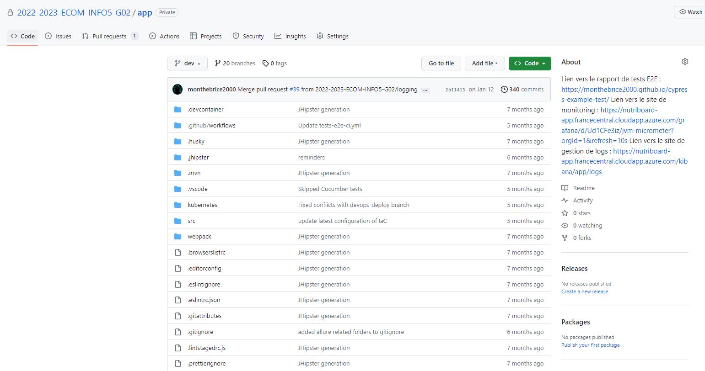
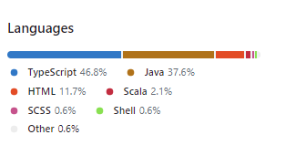
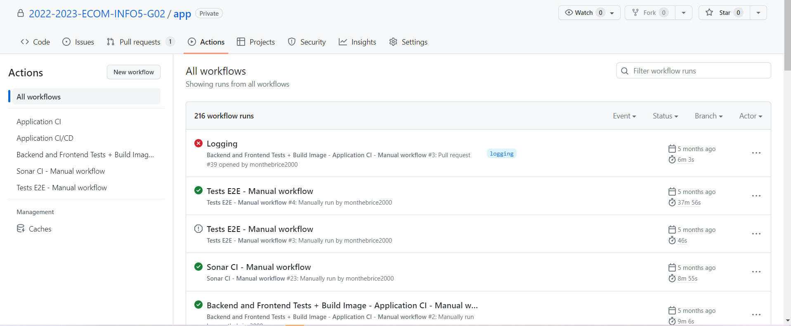
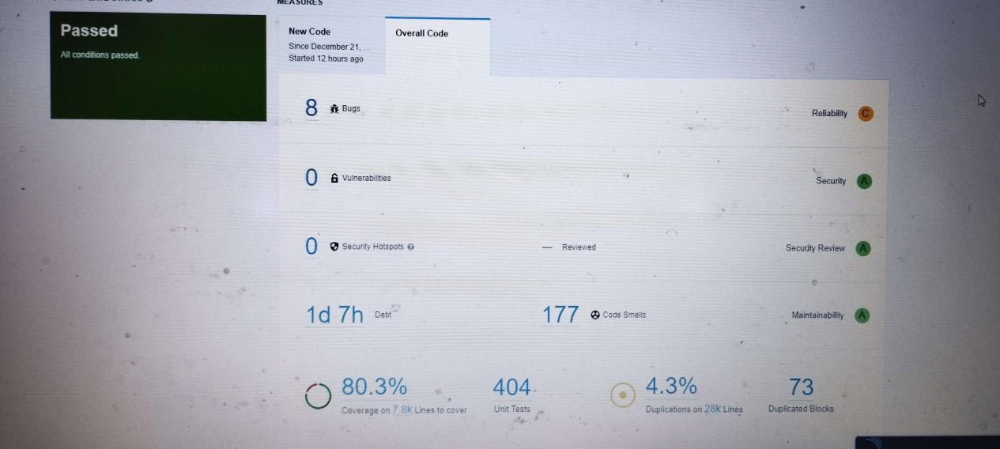
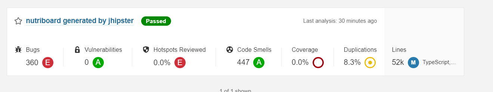
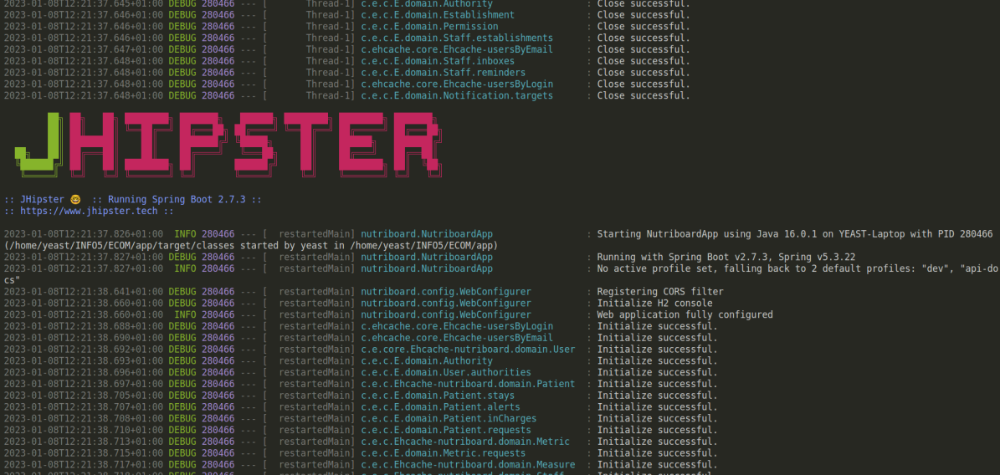
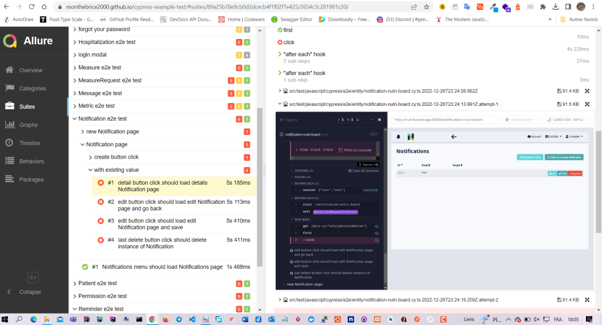

# Project I: Build and deploy nutriboard app

<!---Esses são exemplos. Veja https://shields.io para outras pessoas ou para personalizar este conjunto de escudos. Você pode querer incluir dependências, status do projeto e informações de licença aqui--->

> ce projet académique 2023 consistait à concevoir, implémenter, tester, déployer et administrer une application web de dénutrition dénommée **NUTRIBOARD App**. L'équipe était composée de 2 développeurs backend, 1 développeur frontend, et 2 développeurs DevOps. Et moi, j'ai eu le plaisir d'occuper le poste de DevOps pour découvrir le domaine de  Les technos utilisées sont jhipster, spring, angular, cypress, cucumber, azure cloud, github actions, Sonarqube, Maven, Docker & Kubernetes, Terraform, ELK, Grafana, Prometheus, AlertManager, Trivy, Jira, Git, PostMAN API, REST API, .
> Ces déploiements s'effectuent vers le cloud azure.

## Results

<iframe width="560" height="315" src="https://www.youtube.com/embed/KJI9GZqUo2M" title="YouTube video player" frameborder="0" allow="accelerometer; autoplay; clipboard-write; encrypted-media; gyroscope; picture-in-picture; web-share" allowfullscreen></iframe>
<video src="https://www.youtube.com/watch?v=KJI9GZqUo2M"></video>

<!-- # Build resources with terraform and deploy to azure active directory

 -->

# Project II: Build and Conteneurize Polytech ADE App

> ce projet académique 2023 consistait à concevoir, implémenter, tester, déployer et administrer une application web de dénutrition dénommée **NUTRIBOARD App**. L'équipe était composée de 2 développeurs backend, 1 développeur frontend, et 2 développeurs DevOps. Et moi, j'ai eu le plaisir d'occuper le poste de DevOps pour découvrir le domaine de  Les technos utilisées sont jhipster, spring, angular, cypress, cucumber, azure cloud, github actions, Sonarqube, Maven, Docker & Kubernetes, Terraform, ELK, Grafana, Prometheus, AlertManager, Trivy, Jira, Git, PostMAN API, REST API, .
> Ces déploiements s'effectuent vers le cloud azure.

## Results

