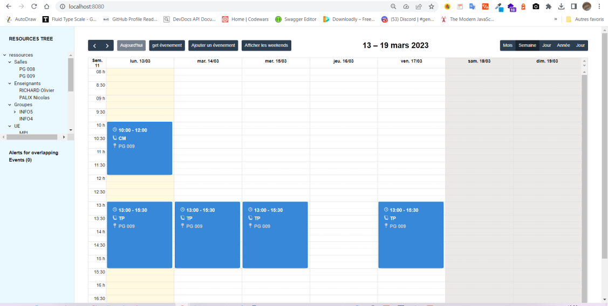

# Project: Build and conteneurize POLYTECH ADE app

<!---Esses são exemplos. Veja https://shields.io para outras pessoas ou para personalizar este conjunto de escudos. Você pode querer incluir dependências, status do projeto e informações de licença aqui--->

> ce projet académique 2023 consistait à concevoir, implémenter, tester, déployer et administrer une application web planification des activités (cours, examens, contrôles continues, congés, projets, ...) sur un calendrier dénommée **POLYTECH ADE App**. L'équipe était composée de 2 développeurs backend + Devvops, 1 développeur frontend. Et moi, j'ai eu le plaisir d'occuper le poste de DevOps et backend pour découvrir le domaine.  Les technos utilisées sont FastAPI, React JS, Docker, Discord, Jira, POSTMAN API, REST API, Swagger API.
> les déploiement devraient s'éffectuer vers le cloud azure, mais pour des sécurités et de privatisation du code source, nous sommes limités à faire des déploiements en local.

## Results

